```{r setup, include=FALSE}
knitr::opts_chunk$set(echo = FALSE, message = FALSE, warning = FALSE, fig.align = "center")
```

# Abstract

In the modern era of data-driven decision-making, organizations must leverage real-time insights to monitor objectives, measure progress, and make informed strategic decisions. Educate Plus, a professional association dedicated to supporting education advancement professionals, manages a broad and diverse membership across multiple regions. As the organization grows, so does the need for timely and accurate data to guide operational decisions. However, they faced challenges in tracking key metrics such as membership engagement, retention, and event attendance, due to fragmented and manual reporting processes.

To address these issues, this project focused on developing three interactive dashboards for them: Members Dashboard, Membership Dashboard, and Events Dashboard to provide real-time, actionable insights. The dashboards to be created were designed to streamline decision-making processes and support various departments within the organization, including marketing, finance, and events.

The dashboards utilize data from membership and event database to provide real-time insights. The tools used in the analysis include CiviCRM platform for data extraction, and Looker Studio for visualization.

The dashboards were designed for the ability to track trends in members, their engagement across the different events. The ability to use the dashboard interactively not only provide Educate Plus with immediate operational benefits but also pave the way for advanced data strategies, help them make informed, data-driven decisions, while establishing a solid foundation for future improvements in data management and reporting processes. The project not only ensures operational efficiency but also supports Educate Plus’s mission to foster community and engagement within the education sector.

The github repository for this project analysis can be accessed here through this [link](https://github.com/akanksha03042001/ETC5543-EducatePlus). Access to the repository and dashboards is limited to authorized personnel due to the confidential personal information in the databases. This report highlights the key features and functionalities.

\newpage

# Introduction

## Background

Educate Plus (@educateplus) is a professional association supporting education advancement professionals across Australasia. Members of the organization work in admissions, fundraising, alumni relations, and marketing, and have access to professional development, networking opportunities, and resources. Educate Plus is committed to managing member engagement and ensuring the success of its events.

Data-driven decision-making is crucial for organizations, enabling them to effectively leverage information and improve operational efficiency (@davenport2017competing). For Educate Plus, monitoring real-time data from its membership base is vital for improving member retention, engagement, and satisfaction. Additionally, tracking event participation through real-time data offers valuable insights into member involvement, allowing them to tailor its event planning and outreach efforts to better meet the needs of its members (@trochlil2016mission).

As the organization has expanded, managing membership and event data has become more challenging. Educate Plus uses CiviCRM (@civicrm), a customer relationship management (CRM) platform designed to manage member data and interactions. With the help of this tool, the organization can easily track key performance indicators (KPIs) like member retention, engagement, and event participation.

To address these limitations, this project focuses on developing three interactive dashboards using Looker Studio (@google_2016). This data visualization tool simplifies the presentation of complex data and provides real-time insights. The dashboards - Members Dashboard, Membership Dashboard, and Events Dashboard are designed to deliver clear, actionable insights that will help Educate Plus make more informed decisions. We have used also used knitr (@knitr) and kableExtra (@kableExtra) packages in R for proper table formatting.

## Goals & Objectives

The goal of this project was to address functional inefficiencies by developing three comprehensive, interactive dashboards: the Members Dashboard, the Membership Dashboard, and the Events Attendance Dashboard. Each dashboard meets specific organizational needs:

1. **Members Dashboard**: This dashboard tracks active membership numbers, member engagement, and trends over time, offering the membership and finance teams essential insights.

2. **Membership Dashboard**:This dashboard tracks member churn by identifying current, new, and lapsed members to help the organization understand their lost member rates and implement strategies to re-engage lost members.

3. **Events Dashboard**: This dashboard tracks event participation, compares attendance trends, and provides insights into member versus non-member engagement at events.

# Methodology

## Data Collection & Processing

Once the organization’s goals were clearly defined, our next step was to analyze the existing reporting framework to determine whether these objectives could be met with the current data flow or if more substantial changes were required. This involved a thorough review of the data flow from CiviCRM, the CRM platform utilized by Educate Plus, to the original EP Membership Summary Dashboard. The current data flow is outlined in \@ref(fig:framework) below.

```{r framework, fig.cap="Existing Reporting Framework",out.width="90%", fig.align="center", fig.pos="H"}
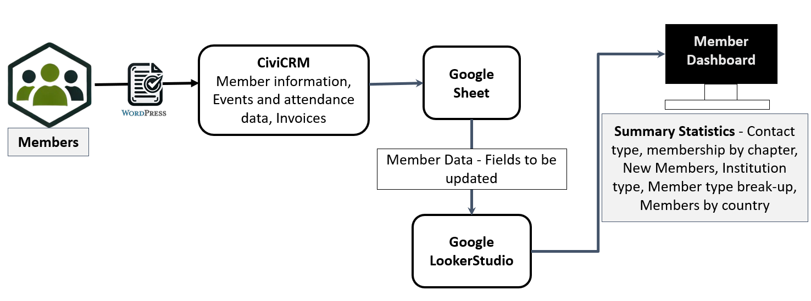
```

As illustrated in image \@ref(fig:framework), member data is initially captured via WordPress forms and stored within CiviCRM. The CRM platform then enriches this data through the generation of additional fields, such as unique Contact IDs, Membership Type, and Membership Status. Once processed, this data is exported to a Google Sheet, where additional pre-processing ensures the variables adhere to the correct format required by the dashboard (e.g. Date of Birth as a date, Contact ID as a Number and Name as Text). This Google Sheet serves as the primary data source for the EP Membership Summary Dashboard.

While this framework provided useful snapshots of membership data, it lacked the depth of calculated metrics necessary for strategic decision-making, particularly in areas such as resource allocation and membership growth analysis. 

```{r table-1}

library(knitr)
library(kableExtra)

# Create a data frame with the given columns
old_table <- data.frame(
  "Column Name" = c(
    "Contact Name", 
    "Membership Type", 
    "Start Date", 
    "Status", 
    "Primary/Inherited?", 
    "Institution Type", 
    "Institution Type 2", 
    "Institution Type 3", 
    "Institution Type 4", 
    "Chapter", 
    "Date Joined", 
    "Date Pack sent", 
    "Regional", 
    "Contact Type", 
    "Organization Name", 
    "is Regional", 
    "City", 
    "State", 
    "Country"
  ),
  "Description" = c(
    "Full name of the member or Organization attached to a membership",
    "Category of membership held by the individual.",
    "Membership start date",
    "Current status of the membership (New, Current, Grace, Expired or Cancelled)",
    "Indicates if the membership type is primary or has been inherited from an existing organization membership",
    "Type of institution the member is associated with",
    "Secondary type of institution",
    "Third type of institution",
    "Fourth type of institution",
    "Regional chapter the member is affiliated with",
    "The date the individual became a member",
    "Date when the welcome or membership pack was sent",
    "Indicates if the member is part of a regional group",
    "Type of contact (Individual or organization).",
    "Name of the organization associated with the contact",
    "Flag indicating regional affiliation",
    "City where the member or organization is located.",
    "State or province where the member or organization is located.",
    "Country where the member or organization is based"
  )
)

kable(old_table, 
      booktabs = TRUE, 
      longtable = TRUE, 
      caption = "Variables used in the staging database") %>%
  kable_styling(
    bootstrap_options = c("striped", "hover", "responsive"),
    latex_options = c("hold_position", "repeat_header", "scale_down"),
    full_width = FALSE,
    position = "center"
  ) %>%
  column_spec(2, width = "10cm")
```

The table \@ref(tab:table-1) above outlines the 19 variables used in the current staging database. However, as discussed later, these variables alone were insufficient to meet the organization’s broader objectives.

### Limitations of the Current Variables

As shown in table \@ref(tab:table-1), the existing variables primarily capture basic membership data but do not provide the critical insights needed to support the organization's strategic goals. Below are key examples illustrating these gaps:

**Lapsed/Cancelled Memberships** : The absence of tracking for lapsed or cancelled memberships limits the organization’s ability to assess member retention rates and understand reasons for member attrition. Without these insights, it is challenging to evaluate the effectiveness of recruitment and retention strategies.

**Demographic Information** : Key demographic data, such as age and gender, is not included, preventing the organization from analyzing the diversity of its membership base. This information is essential for tailoring communications and services to different demographic groups and ensuring inclusivity.

**Special Interests** : There is no data capturing members’ specific interests, such as their involvement in Educate Plus's nine key pillars (e.g., Admissions, Alumni, Fundraising). Without these insights, it is difficult to personalize content, events, or resources based on individual member preferences, limiting the organization’s ability to foster deeper engagement.

### Building the New Data Flow

Recognizing the limitations of the current variables, we conducted a comprehensive review of all data points collected by the organization and identified additional variables that would fulfill the organization’s needs. This led to the development of a new data flow that allowed more variables to flow into the dashboard, thus allowing us to glean more in-depth insights.

The IT team at Educate Plus collaborated with us to design this new data flow, as depicted in image \@ref(fig:new-framework) below.

```{r new-framework, fig.cap="New Reporting Framework",out.width="90%", fig.align="center", fig.pos="H"}
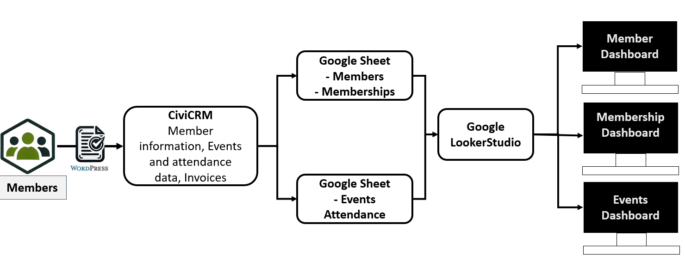
```

In the new data flow, after data is captured in CiviCRM, it is extracted into two distinct Google Sheets. Google Sheet 1 contains membership data and serves as the source for both the Members Dashboard and the Memberships Dashboard, while Google Sheet 2 contains event attendance data and is used for the Events Dashboard. This separation of data sources allows for more focused analysis, ensuring that each dashboard provides specific insights relevant to its scope.

The variables included in the Google Sheet 1 (Member and Membership data are shown in) table \@ref(tab:table-2)

```{r table-2}

# Create a data frame with the columns and descriptions
table_2 <- data.frame(
  "Column Name" = c(
    "Contact Name", 
    "Membership Type", 
    "Start Date", 
    "Status", 
    "Primary/Inherited?", 
    "Institution Type", 
    "Institution Type 2", 
    "Institution Type 3", 
    "Institution Type 4", 
    "Chapter", 
    "Date Joined", 
    "Date Pack sent", 
    "Regional", 
    "Contact Type", 
    "Organization Name", 
    "is Regional", 
    "City", 
    "State", 
    "Country", 
    "Join Date", 
    "Contact ID", 
    "Gender", 
    "Birth Year", 
    "Age", 
    "Special Interests", 
    "Admissions", 
    "Alumni", 
    "Community Relations", 
    "Events", 
    "Fundraising", 
    "International Recruitment", 
    "Leadership", 
    "Marketing & Communication", 
    "People & Culture"
  ),
  "Description" = c(
    "Full name of the member or Organization attached to a membership",
    "Category of membership held by the individual.",
    "Membership start date",
    "Current status of the membership",
    "Indicates if the membership type is primary or inherited",
    "First classification of institution type",
    "Second classification of institution type",
    "Third classification of institution type",
    "Fourth classification of institution type",
    "Regional chapter the member is affiliated with",
    "The date the individual became a member",
    "Date when the welcome or membership pack was sent",
    "Indicates if the member is part of a regional group",
    "Type of contact (Individual or organization).",
    "Name of the organization associated with the contact",
    "Flag indicating regional affiliation",
    "City where the member or organization is located.",
    "State or province where the member or organization is located.",
    "Country where the member or organization is based",
    "Date the member joined the organization",
    "Unique identifier for the contact in the database",
    "Gender of the member",
    "Year of birth of the member",
    "Calculated age of the member based on birth year",
    "Interests of each member across the 9 pillars of Educate Plus",
    "Pillar 1: Admissions",
    "Pillar 2: Alumni",
    "Pillar 3: Community Relations",
    "Pillar 4: Events",
    "Pillar 5: Fundraising",
    "Pillar 6: International Recruitment",
    "Pillar 7: Leadership",
    "Pillar 8: Marketing & Communication",
    "Pillar 9: People & Culture"
  )
)


kable(table_2, 
      booktabs = TRUE, 
      longtable = TRUE, 
      caption = "Variables used in the members database") %>%
  kable_styling(
    bootstrap_options = c("striped", "hover", "responsive"),
    latex_options = c("hold_position", "repeat_header", "scale_down"),
    full_width = FALSE,
    position = "center"
  ) %>%
  column_spec(2, width = "10cm") # Set width for Description column


```

The variables included in the Google Sheet 2 (Events Attendance data are shown in) table \@ref(tab:table-3).


```{r table-3}
# Create a data frame with column names and descriptions
events_dataset <- data.frame(
  Column_Heading = c("Participant Name", "First Name", "Last Name", "Gender", 
                     "Contact Job Title", "Organization Name", "Contact ID", 
                     "Email", "City", "State/Province", "Country", "ID", 
                     "Participant ID", "Event ID", "Status", "Role", "Fee Level", 
                     "Participant Fee", "Registration Date", "Total Paid", 
                     "Event Type", "Event Start Date", "Event End Date", "Chapter", 
                     "Institution Type", "Participant Status", "Are You a Sponsor?", 
                     "Half Day Workshops", "Full Day Workshop - Masterclass", 
                     "Welcome Drinks Day 1", "Gala Dinner", "Awards Luncheon", 
                     "Gala Dinner Day 3", "Which Topics Interest You for This Event?"),
  
  Description = c("Full name of the event participant", "Participant's first name", 
                  "Participant's last name", "Participant's gender identification", 
                  "Job title of the participant", "Name of the organization the participant is associated with", 
                  "Unique identifier for the participant's contact details", 
                  "Email address of the participant", "City where the participant is based", 
                  "State or province of the participant", "Country of the participant", 
                  "General ID of the participant record", "Unique identifier for the participant within the event", 
                  "Unique identifier for the event the participant is registered for", 
                  "Registration status of the participant (e.g., Registered, Attended)", 
                  "Role of the participant in the event (e.g., Attendee, Speaker)", 
                  "Category of fees applicable to the participant", 
                  "Fee paid by the participant for the event", 
                  "Date when the participant registered for the event", 
                  "Total amount paid by the participant", "Type of the event (e.g., Workshop, Conference)", 
                  "Date when the event starts", "Date when the event ends", 
                  "Regional chapter or group associated with the event", 
                  "Type of institution the participant represents", 
                  "Membership status of the participant (Member, Non-Member)", 
                  "Indicates if the participant is an event sponsor", 
                  "Indicates participation in half-day workshops", 
                  "Indicates participation in full-day workshops or masterclasses", 
                  "Indicates attendance at welcome drinks on Day 1 of the event", 
                  "Indicates attendance at the gala dinner", 
                  "Indicates attendance at the awards luncheon", 
                  "Indicates attendance at the gala dinner on Day 3", 
                  "Topics of interest specified by the participant for the event")
)

kable(events_dataset, 
      booktabs = TRUE,
      longtable = TRUE,
      col.names = c("Column Heading", "Description"), 
      caption = "Columns housed in GoogleSheet 2. This acts as the source for the Event Attendees Dashboard.") %>%
 kable_styling(bootstrap_options = c("striped", "hover", "responsive"),
                latex_options = c("hold_position","repeat_header","scale_down"),
  )

```

## Dashboard Development

Once the new data flow was established, we developed three key dashboards to address the organization’s requirements: the Members Dashboard, the Memberships Dashboard, and the Events Dashboard. Interactive dashboards have become an invaluable tool for organizations to visualize and act on data trends in real-time, enabling faster decision-making and operational agility (@velcu2012use). 

We used an iterative approach shown in image \@ref(fig:approach) to build each dashboard involving the following steps; We understood their requirements and purpose, Identified the key stakeholders, We built wire frames of each dashboard to show how each metric would be displayed, received feedback from the team, built the dashboard and finally tested it. Once this was done, it was made live and deployed. 

```{r approach, fig.cap="Approach Taken", out.width="200px", fig.align="center", fig.pos="H"}
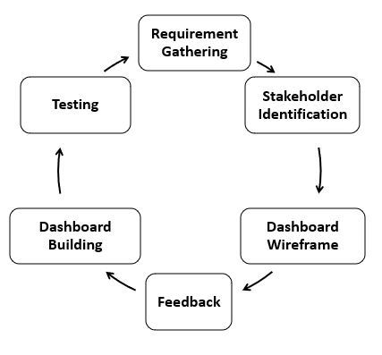
```

### Dashboard Development; The Members Dashboard

The Members Dashboard is a critical tool that provides an in-depth view of the organization's current membership landscape. It was designed to address specific organizational goals, such as tracking membership growth, demographic diversity, and engagement levels. The members dashboard is shown in image \@ref(fig:member-1) and \@ref(fig:member-2).

```{r member-1, fig.cap="Members Dashboard Page 1",out.width="90%", fig.align="center", fig.pos="H"}
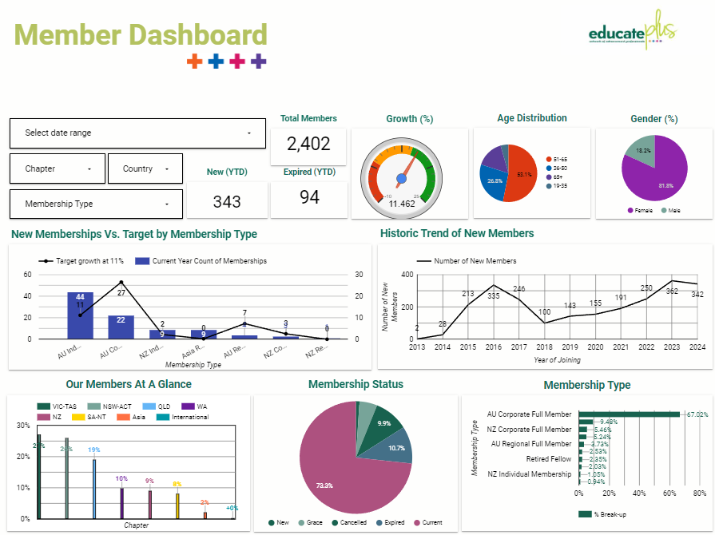
```

```{r member-2, fig.cap="Members Dashboard Page 2",out.width="90%", fig.align="center", fig.pos="H"}
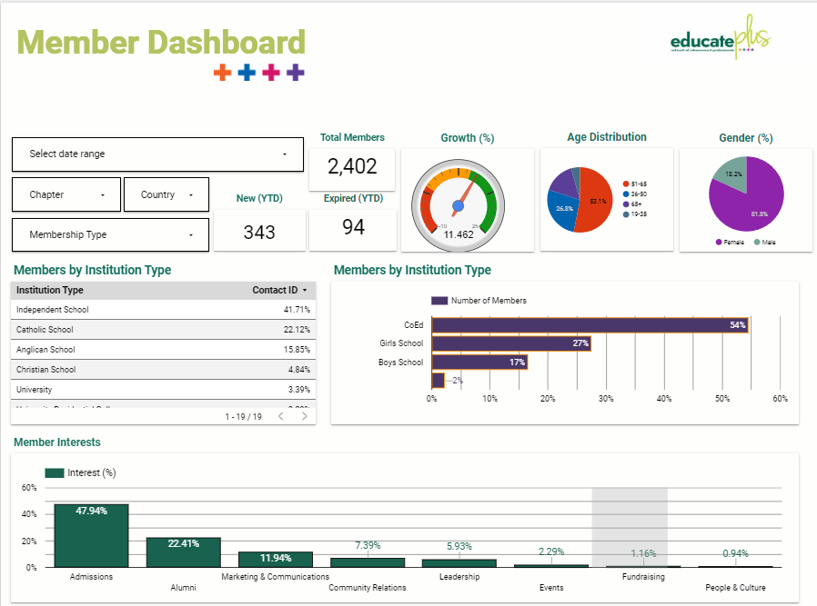
```

Key components of the Members Dashboard include:

**Total Members, New Members (YTD), and Expired Members (YTD)**
At the top of the dashboard \@ref(fig:member-1) , key figures such as the total number of members, new members acquired year-to-date (YTD), and expired memberships are prominently displayed. These figures provide an at-a-glance understanding of the organization's current membership base and its trends throughout the year. Total Members shows the cumulative count, while New Members (YTD) and Expired Members (YTD) track recent membership changes. The calculations and collection of the variables were automated within Looker Studio, minimizing manual input and providing real-time updates.  

**Growth (%)**
The growth gauge gives an immediate visual representation of membership growth over a selected period. A percentage growth indicator allows the organization to assess whether it is meeting its growth targets and make necessary adjustments to its recruitment and retention efforts. 

**Age Distribution**
The age distribution pie chart provides a breakdown of the membership across various age groups, such as 19-35, 36-50, and 51-65+. This information is crucial for ensuring that the organization's services and communications are tailored to meet the needs of different age demographics. Understanding the age distribution also helps in creating targeted outreach campaigns, events, and programs for different segments of the membership base.

**Gender Distribution**
The gender distribution chart offers a quick visualization of the percentage of male and female members within the organization. This information can help the organization assess its inclusivity efforts and identify opportunities to engage underrepresented demographics. Gender distribution insights are important for understanding how membership reflects the broader industry demographic and for ensuring diversity in both participation and leadership within the organization.

**New Memberships vs. Target by Membership Type**
This bar chart compares the current year’s count of new memberships with the organization's target growth rate, set at 11%. It categorizes the data by membership types (e.g., AU Corporate Full Member, AU Individual Member). By showing whether each membership type is meeting its growth target, this chart helps the organization pinpoint areas that require more recruitment effort or areas where membership growth is particularly strong. This is essential for prioritizing recruitment resources and determining the success of different membership categories.

**Historic Trend of New Members**
The historical trend line chart tracks the number of new members over the years (2013-2024), helping the organization evaluate long-term membership trends. This allows stakeholders to assess the impact of different membership drives or external factors on recruitment rates. 

**Our Members at a Glance (Regional Distribution)**
This bar chart breaks down membership across various regional chapters, including regions like VIC-TAS, NSW-ACT, and WA. Regional distribution insights allow Educate Plus to allocate resources efficiently and ensure that all chapters are supported based on their membership size. This data is also critical for regional planning, such as organizing events and outreach initiatives in chapters that may have lower representation.

**Membership Status**
The pie chart of membership status provides a breakdown of the overall membership by status: New, Grace, Cancelled, Expired, and Current. The organization can use this information to monitor its retention efforts and understand the current distribution of active versus inactive members. 

**Membership Type Distribution**
The bar chart for membership type breaks down the membership base by categories such as AU Corporate Full Member, AU Regional Full Member, and NZ Corporate Full Member. This chart provides insights into which membership categories are most popular, allowing the organization to evaluate the effectiveness of different membership offerings. F

**Members by Institution Type**
This section shown in page \@ref(fig:member-2) gives a breakdown of members by the type of institution they are affiliated with, such as Independent School, Catholic School, Anglican School, Co Ed, and more. This is crucial for identifying which institution types are most engaged with Educate Plus and where outreach efforts need to be intensified. 

**Member Interests**
The member interests bar chart visualizes the specific areas of interest among members across the nine pillars of Educate Plus. Admissions, Alumni, Marketing & Communications, Community Relations, Leadership, Events, People & Culture and Fundraising. This information enables the organization to deliver targeted content, webinars, and events that cater to the top interests of its members or when expanding into new international markets. 

### Dashboard Development; The Membership Dashboard

The Membership Dashboard offers a complete overview of current membership distribution, retention rates, and growth in new members, categorized by membership type and chapter. This dashboard is crucial for the membership and finance teams at Educate Plus. The membership dashboard is shown in  \@ref(fig:membership-1) and \@ref(fig:membership-2).

```{r membership-1, fig.cap="Membership Dashboard Page 1",out.width="90%", fig.align="center", fig.pos="H"}
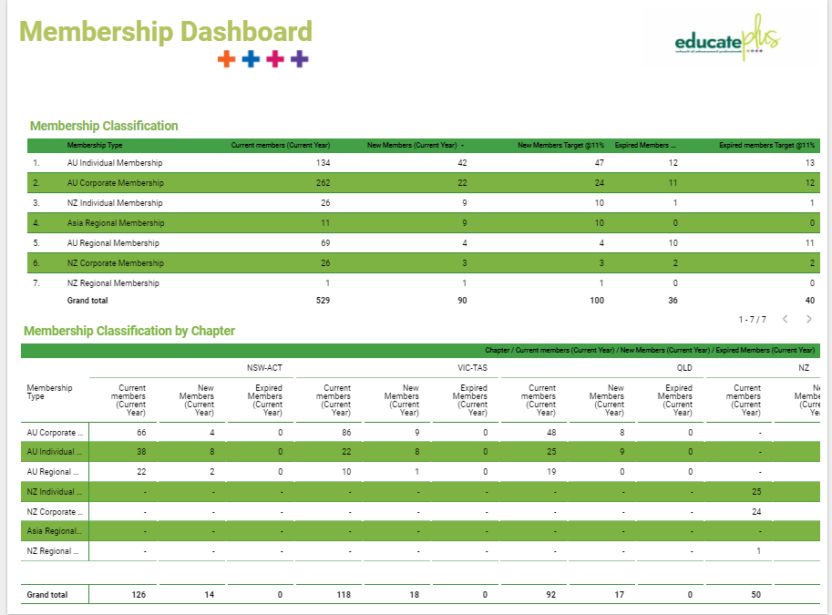
```

```{r membership-2, fig.cap="Membership Dashboard Page 2",out.width="90%", fig.align="center", fig.pos="H"}
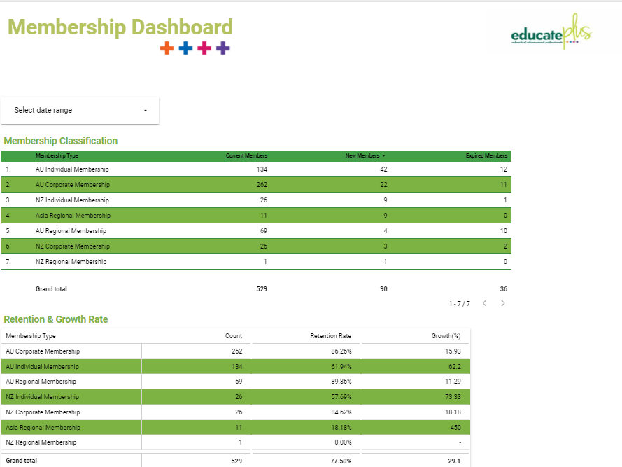
```

The key elements of the Membership Dashboard are: 

**Membership Classification by Type & Chapter** 
The dashboard categorizes memberships by type (e.g., AU Corporate, NZ Individual, Asia Regional) and chapter (e.g., NSW-ACT, VIC-TAS, QLD, NZ). This enables stakeholders to visualize the distribution of current members, new members, and expired memberships across different types and regions. Educate Plus can effectively prioritize its engagement resources by understanding member concentrations and identifying areas with lower membership.

**Retention & Growth Rate** 
The Retention and Growth Rate section in image \@ref(fig:membership-2) presents the retention percentage and growth rate for each membership type. It allows the organization to develop targeted retention campaigns based on areas in which retention efforts may be lacking. It provides a quick evaluation of how successful recruitment has been, as it indicates the percentage growth in memberships from year to date. Developing initiatives designed to engage specific membership types, like NZ Individual Membership, may be necessary if the retention rate is low, like 59.26%.

**Expired Members & Retention Strategy**
It shows the number of expired memberships categorized by type and chapter, enabling stakeholders to identify areas where member retention may be challenging quickly. For example, if the AU Regional Membership shows many expired memberships, the membership team could consider launching targeted outreach efforts to re-engage those lapsed members.

**New Members & Expired Members Target**
This part of the dashboard compares the number of new and expired members to the organization’s growth and retention targets, which are set at 11%. By displaying how new and expired memberships align with these targets, Educate Plus can assess whether its recruitment and retention efforts are meeting expectations.

**Setting Future Targets**
Based on this YTD's performance, the dashboard allows stakeholders to automatically set target growth rates for the upcoming year, making future planning more efficient.

**Date Range Control:**
Stakeholders can use the date range filter as in image \@ref(fig:membership-2) to analyze new and expired member counts over specific periods, such as monthly or quarterly. This feature is particularly useful for observing trends and understanding seasonal variations in membership changes.

### Dashboard Development; The Events Dashboard

The Events Dashboard is designed to provide detailed insights into Educate Plus’s event performance, including metrics such as total events held, registrations, attendance rates, and revenue generated from different events. This dashboard plays a crucial role in understanding how events contribute to organizational engagement and revenue, as well as tracking the success of various events across different chapters and member groups. The events dashboard us shown in image \@ref(fig:events-1), \@ref(fig:events-2) and \@ref(fig:events-3).

```{r events-1, fig.cap="Events Dashboard Page 1",out.width="90%", fig.align="center", fig.pos="H"}
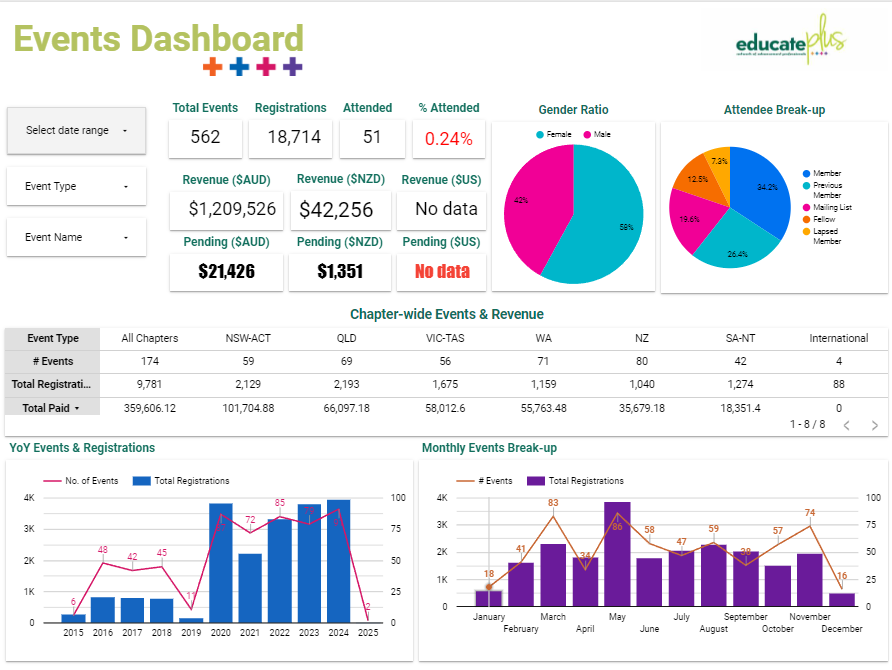
```

```{r events-2, fig.cap="Events Dashboard Page 2",out.width="90%", fig.align="center", fig.pos="H"}
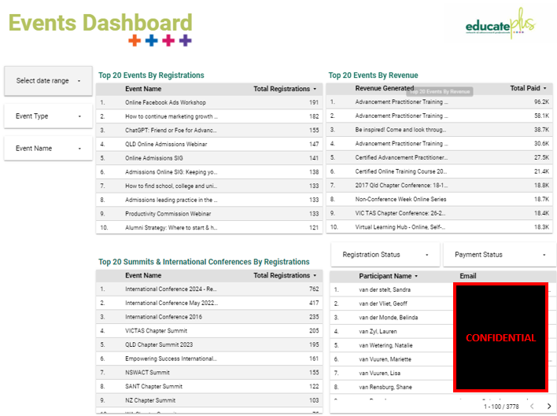
```

```{r events-3, fig.cap="Events Dashboard Page 3",out.width="90%", fig.align="center", fig.pos="H"}
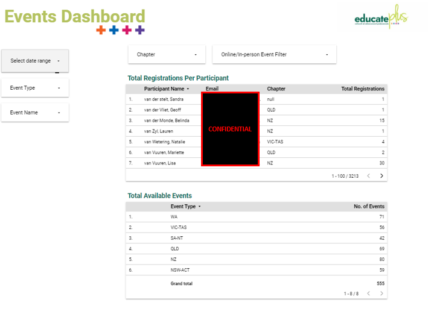
```

The key elements of the Events Dashboard are: 

**Total Events, Registrations, and Attended Events** - These key figures provide a high-level overview of Educate Plus’s event activity. Total Events displays the number of events held, while Registrations captures the total number of registrations across all events. Attended Events shows the actual attendance figures, allowing stakeholders to compare registration and attendance rates and assess engagement levels.

**Attendance Rate (%)** - An attendance rate metric was set by calculating the ratio of attendees to registrants for each event. This ratio was then shown as a percentage in a visual format, allowing stakeholders to quickly and easily assess engagement at a glance.

**Revenue Generated** - The dashboard tracks revenue in various currencies (AUD, NZD, and USD), allowing the organization to measure the financial success of its events. Understanding which events generate the most revenue helps guide future event planning and resource allocation. Additionally, pending revenue figures highlight amounts that are yet to be collected, providing insight into the financial pipeline and expected future income.

**Gender Ratio** - The gender ratio pie chart illustrates the proportion of male and female attendees at events. This demographic data is crucial for ensuring inclusivity and understanding how different gender groups are engaging with the organization's events. 

**Attendee Breakdown** - The attendee break-up pie chart shows the types of attendees, including members, previous members, mailing list contacts, and fellows. This breakdown is essential for identifying how different groups of stakeholders are engaging with Educate Plus events and targeting future outreach efforts accordingly. 

**Chapter-Wide Events and Revenue** - This table provides a chapter-wise breakdown of the number of events held, total registrations, and revenue generated across different chapters, including NSW-ACT, QLD, VIC-TAS, WA, NZ, and more. By comparing chapter performance, Educate Plus can identify regions with high engagement and those requiring more support or resources. Additionally, chapter-specific data enables tailored event planning to meet the unique needs of each region.

**Year-over-Year (YoY) Events & Registrations** - 
  The YoY chart tracks the number of events and registrations over the years (2015-2025), allowing the organization to identify trends in event activity and engagement. Spikes or declines in event participation can be analyzed in relation to external factors such as economic changes, industry trends, or organizational initiatives, helping to refine event strategies moving forward.

**Monthly Events Breakdown**
The Monthly Events Breakdown chart was developedto provide insights into seasonal trends in event participation. This component displays the total number of events and registrations each month, allowing stakeholders to understand cyclical engagement patterns.

**Top 20 Events by Registrations and Revenue**
These tables in image \@ref(fig:events-2) lists the top 20 events by total registrations and Revenue, showing which events attracted the highest number of attendees and Revenue. By understanding which topics or formats drive the most registrations and Revenue, Educate Plus can prioritize similar events in the future to maximize engagement.

**Participant Registration Status**
The registration status table provides granular data on individual participants, including their chapter, email, and number of events registered for. This level of detail helps Educate Plus track participation at a personal level and follow up with participants who may need assistance with registration or payment.

**Member Engagement Page**
In the image \@ref(fig:events-3) of the Events Dashboard, two key tables show Total Registrations per Participant and Total Available Events by chapter. These tables can be exported into an Excel sheet for further analysis, where thresholds can be set by the user to classify each participant's engagement level as Low, Moderate, or High. The classification is calculated as a percentage, comparing the number of events attended by a participant to the total available events.

Once exported to Excel, the following steps occur:

- **Threshold Setting**: Users can set thresholds for Low, Moderate, and High Engagement based on their specific criteria.

- **Formula for Classification** - Predefined formula calculate engagement levels by comparing the number of events attended to the total available events per participant. This enables Educate Plus to easily identify highly engaged members and those who may require additional outreach or encouragement to participate more actively.

By utilizing this tool, Educate Plus can effectively segment its membership and tailor its engagement strategies to different levels of participation. High-engagement members might be prioritized for leadership roles or targeted for special opportunities, while low-engagement members could be the focus of retention efforts.

### Discussion; Clustering to Segment Members by Engagement Levels

```{r engagement, fig.cap="Clustering to Segment Members by Engagement Level",out.width="90%", fig.align="center", fig.pos="H"}
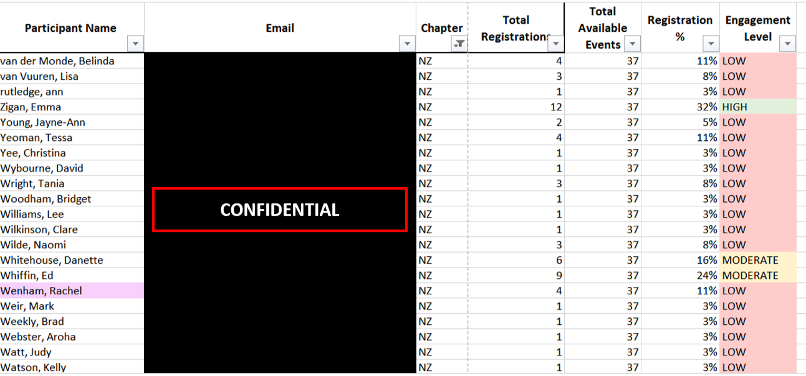
```

In the project, one of the key objectives was to segment members based on their engagement levels, specifically using their event participation data. The aim was to group participants into categories like Frequent Participants, Moderately Active, and Inactive/Low-Engaged based on their attendance records. This was done using clustering techniques, particularly K-means clustering, which allowed for automated segmentation based on historical participation metrics. The overview of how the clustering output is show in in image \@ref(fig:engagement).

#### Why This Approach Worked Well

-   Objective Engagement Analysis: By employing K-means clustering, we leveraged a data-driven approach to categorize members into distinct engagement levels. Instead of relying on arbitrary thresholds, K-means optimized the clusters based on the actual distribution of event participation. This ensured that members were classified in an objective and meaningful way, reflecting their actual levels of engagement.

-   Efficient Data Segmentation: K-means clustering allowed us to process a large amount of event data and group members into segments that would enable tailored communication and strategic engagement. For example, members in the "Frequent Participants" cluster could be thanked for their loyalty, while "Inactive" members could receive targeted offers to re-engage.

-   Actionable Insights: The clusters created through this method provided actionable insights. For example, we could easily identify members with low engagement who might benefit from personalized outreach or incentives. Similarly, identifying high-engagement members allowed us to recognize and reward loyal participants, potentially offering them early access to events or special content.

-   Flexibility of K-means: K-means clustering is flexible and allows for recalculation of clusters when new data is available. This is especially useful in longitudinal projects where event participation data is regularly updated. The iterative nature of K-means ensures that clusters stay relevant as the dataset evolves over time.

-   Visualization and Reporting: Using tools like ggplot2 (@ggplot2), we visualized the clusters effectively, giving the team a clear picture of engagement levels across participants. Visualization of the clusters not only made the data insights more accessible but also allowed us to communicate the findings in a format that could guide strategic decisions for event planning and member retention strategies.

#### Challenges: Lack of Access to R for Updating Data

While the clustering approach worked effectively for segmenting members, a notable limitation was that the Educate Plus team lacked access to the R programming environment, and the team had limited experience with coding-based tools. This presented a challenge for sustainability and adaptability of the solution.

-   Cluster Center Adjustments: The K-means algorithm requires re-training when new data comes in or when the organization wishes to adjust the cluster centers based on evolving engagement trends. Without easy access to R, the team would not be able to run these updates independently. This reliance on external tools or analysts to update the data presented a challenge for seamless workflow integration.

-   Sustainability of the Solution: While R is a powerful tool for statistical analysis and data segmentation, the lack of in-house expertise in coding meant that this solution was not sustainable in the long term. To ensure the project’s success, a solution with more intuitive and user-friendly data updating mechanisms, like a dashboard that can automatically handle cluster updates, would have been more practical.

#### Limitations in Implementation

- Manual Data Updates: Each time new data comes in, the cluster model needs to be retrained. This was done in R, but without direct access to this environment, the Educate Plus team could not autonomously refresh or update the clusters. This is a major limitation, as engagement levels can change frequently, especially with new events and member activities.

- Complexity of Tooling: While the clustering technique itself worked well, introducing a complex tool like R into an organization unfamiliar with coding can slow down adoption and hinder scalability. A more intuitive tool like Power BI or Tableau would allow the organization to blend data from different sources (e.g., event participation data and member information) and even integrate predictive analytics, which would allow non-technical users to update the data and refine the model without requiring deep technical skills.

- Dynamic Clusters: Ideally, the segmentation of members should not be static. The K-means clusters were calculated based on current event participation data, but as more events are held, member participation may change, and the clusters should dynamically adjust to reflect this. Without a simple, automated way to do this, the clusters may become outdated.

## KPIs and Analytical Choices

To accurately assess member engagement, event performance, and membership trends, a comprehensive set of Key Performance Indicators (KPIs) were chosen and integrated across three dashboards: **Members Dashboard**, **Memberships Dashboard**, and **Events Dashboard**. Key Performance Indicators (KPIs) offer a quantitative basis for evaluating organizational success, especially in tracking engagement and retention in membership-driven organizations (@kerzner2022project).

These KPIs align with Educate Plus’s strategic objectives, providing valuable insights into growth, engagement, financial outcomes, and retention. The KPIs were selected to ensure that both high-level and operational goals could be monitored effectively.

### Members Dashboard KPIs

1. **Total Members, New Members (YTD), and Expired Members (YTD)** - These KPIs provide a high-level overview of the current membership base, new additions for the year, and memberships that have expired, supporting tracking of membership growth and retention.

-   **Data Source**: All data is sourced from Educate Plus’s CRM, and the KPIs are updated in real-time in Looker Studio.

2. **Members/Membership Growth Percentage (%)** - This KPI measures the rate of membership growth, helping assess the effectiveness of recruitment efforts and overall organizational health.

-   **Calculation**:
$$
\mathrm{Growth\ Percentage} = \left( \textstyle \frac{\mathrm{Total\ Member\ Count\ (Current\ Year)} - \mathrm{Total\ Member\ Count\ (Previous\ Year\ as\ of\ 31st\ December)}}{\mathrm{Total\ Member\ Count\ (Previous\ Year\ as\ of\ 31st\ December)}} \right) \times 100
$$

-   **Data Source**: Membership data from the CRM is compared year-over-year, allowing Looker Studio to automatically calculate the growth rate.

3. **Members/Membership Retention Rate (%)** - The retention rate measures the percentage of members who renew their memberships, providing insights into member satisfaction and the effectiveness of retention strategies.
-   **Calculation**:
$$
\mathrm{Retention\ Rate} = \left(\textstyle \frac{\mathrm{Total\ Memberships\ Count\ (Current\ Year)} - \mathrm{New\ Memberships\ Count\ as\ of\ 1st\ January\ (Current\ Year)}}{\mathrm{Total\ Memberships\ Count\ (Current\ Year)}} \right) \times 100
$$

- **Data Source**: Renewal and membership data are extracted from the CRM, and the retention rate is calculated automatically in Looker Studio.

4. **Gender Distribution and Age Distribution** - These KPIs track the demographics of members, helping the organization understand its member composition and tailor engagement strategies to different age groups and gender demographics.

-   **Calculation**:

    -   *Gender Distribution*: Ratio of male to female members as a percentage of the whole.

    -   *Age Distribution*: Members segmented into predefined age groups as a percentage of the whole.

-   **Data Source**: Gender and age data is extracted from the CRM and displayed in real-time in Looker Studio.

### Memberships Dashboard KPIs

5. **Membership by Institution Type and Chapter** - These KPIs give a detailed breakdown of members by the type of institution they are associated with (e.g., schools, universities) and by regional chapters, enabling more targeted engagement strategies.

-   **Data Source**: Institution and chapter data are pulled from CRM records, automatically aggregated in Looker Studio.

6. **Membership Status Breakdown (New, Current, Grace, Expired, Cancelled)** - This KPI tracks the current membership status of individuals, allowing the organization to identify the proportion of active, lapsed, and at-risk members.

-   **Data Source**: Membership status data is sourced from the CRM and automatically displayed in Looker Studio.

### Events Dashboard KPIs

8. **Total Events, Registrations, and Attended Events** - These KPIs track the volume of events, total registrations, and actual attendance, helping to evaluate event popularity and effectiveness.

-   **Data Source**: Event data is extracted from the CRM and processed in real-time by Looker Studio.

9. **Attendance Rate (%)** - This KPI measures the percentage of registered participants who attended events, providing insights into engagement and event success.

-   **Calculation**:
$$
\mathrm{Attendance\ Rate\ (\%)} = \left(\textstyle \frac{\mathrm{Total\ Attended}}{\mathrm{Total\ Attended} + \mathrm{Total\ Registered}} \right) \times 100
$$

-   **Data Source**: Registration and attendance data are sourced from the CRM, and the attendance rate is calculated in Looker Studio.

10. **Revenue Generated (AUD, NZD, USD)** - This KPI tracks event revenue across different currencies, helping Educate Plus monitor financial performance and assess the success of revenue generation strategies.

-   **Data Source**: Payment data is sourced from the CRM, and Looker Studio handles currency-based segmentation for accurate reporting.

11. **Top Events by Revenue and Registrations** - Highlighting the top 20 events by revenue and registrations helps Educate Plus identify successful event formats and topics that drive engagement and financial growth.

-   **Data Source**: Data is pulled from CRM event records and payment entries, dynamically updated as new data comes in.

12. **Chapter-Wide Event Engagement** - This KPI breaks down event participation and revenue by chapter, allowing the organization to allocate resources effectively and focus on regions with high engagement.

-   **Data Source**: Chapter data is tagged in CRM entries, allowing for automatic grouping and segmentation in Looker Studio.

13. **Year-over-Year (YoY) Events and Registrations** - The Year-over-Year KPI helps track trends in event participation, allowing for long-term strategic planning by comparing the number of events and registrations each year.

-   **Data Source**: Historical data from the CRM allows for accurate trend analysis in Looker Studio.

14. **Participant Engagement Levels (Exported to Excel)** - This KPI enables offline analysis of engagement, allowing stakeholders to classify participants into Low, Moderate, or High Engagement based on their event attendance.

-   **Calculation**:
$$
\mathrm{Engagement\ Level\ (\%)} = \left( \textstyle \frac{\mathrm{Total\ Number\ of\ Events\ Attended\ per\ Person}}{\mathrm{Total\ Number\ of\ Events\ Available\ to\ Each\ Person}} \right) \times 100
$$

-   **Data Source**: Event data is exported from Looker Studio for further analysis in Excel.

## Challenges Encountered

During the development of the dashboards, we encountered several data and technical challenges that shaped our approach and solutions.

**Members Dashboard** - Our initial member count showed inconsistencies when compared to the existing members dashboard. It was primarily because our figures did not include canceled members. After consulting with the IT team, we adjusted our count to align with their criteria. Additionally, we identified and corrected duplicate and missing records in the CiviCRM export to ensure consistency.

Frequent crashes in Looker Studio added another layer of complexity. To stabilize the dashboard, we removed the date dimension and reconnected the data source, which improved its reliability. To further ensure accurate reporting, we filtered out null values to prevent any misrepresentation of the members data.

**Membership Dashboard** - The dashboard displayed various data quality issues, including duplicate organization names and null values in critical fields, which skewed our insights. These entries were filtered and cleaned to offer a more accurate view.

An evolving classification system also required adjustments. Based on client feedback, we removed outdated membership types and focused on the seven newly defined categories. This shift required re configuring the dashboard to align with Educate Plus's current membership structure, delivering more relevant insights for stakeholders.

**Events Attendance Dashboard** - Creating the Events Dashboard came with several challenges. One issue we faced was duplicate entries for the organizations, which increased the events attendance counts. We resolved this by cleaning the data to ensure each organization was represented uniquely.

Additionally, our mentor requested a year-over-year comparison of event registrations. However, due to limitations in Looker Studio, we couldn't make direct date comparisons. Instead, we calculated and visualized year-over-year trends in event counts and registrations to provide an approximate view of event growth.

# Results

## Dashboard Overview

Building on the data processing and design steps outlined in the methodology, we developed three final dashboards: the **Members Dashboard**, the **Membership Dashboard** and **Events Attendance Dashboard**. These dashboards provide Educate Plus with powerful, interactive tools to monitor the KPIs. Each dashboard is specifically tailored to meet the organization’s needs, offering customization filters, drill-down capabilities, and real-time insights that empower stakeholders to make data-driven decisions. 

The dashboards focus on different aspects of membership, including growth tracking, engagement analysis, retention, and classification metrics. Below, we will explore each dashboard in detail, highlighting their features, interactive elements, and the insights gained from these tools.

### Members Dashboard 

The Members Dashboard provides an interactive view of membership metrics, enabling stakeholders to filter data by chapter, membership type, and other key dimensions.

The key insights of the dashboard includes:

- **Total Members Count and Growth Tracking** 

```{r insight-1, fig.cap="Growth Tracking",out.width="200px", fig.align="center", fig.pos="H"}
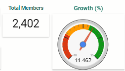
```

The growth calculator shown in \@ref(fig:insight-1) updates dynamically based on new membership additions as it is a live data, which shows the organization's progress toward its annual growth objectives. By monitoring actual vs the target growth, stakeholders can easily pinpoint areas that may need extra attention to meet membership goals.
The monthly and quarterly trends in the growth calculator help stakeholders identify slow periods, allowing them to adjust recruitment efforts accordingly. For instance, if membership numbers are low during a specific quarter, the team can launch targeted campaigns to boost engagement in that time frame.

- **Special Interest of Members** 

```{r insight-2, fig.cap="Member Interest",out.width="80%", fig.align="center", fig.pos="H"}
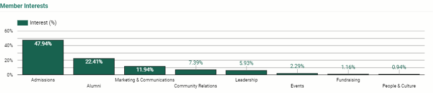
```

This chart shown above in image \@ref(fig:insight-2) offers valuable insights into the areas where members are most engaged, enabling marketing and relations team of Educate Plus to tailor its resources accordingly. This alignment can help enhance member engagement and satisfaction.
By visualizing member interests, the organization can prioritize areas of high interest. If alumni relations are a significant focus, Educate Plus might enhance programming or resources in this sector, leading to more effective engagement strategies.

- **Chapter and School Institution Type Breakdown** 

```{r insight-3, fig.cap=" Members by Insititution Type and Chapter Breakdown",out.width="200px", fig.align="center", fig.pos="H"}
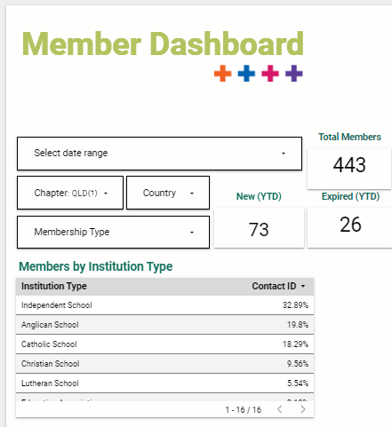
```

Interactive filters enables the stakeholders to explore data by chapter and membership type, providing more detailed insights. 
For example, when we examine the Queensland-specific chapter as shown in image \@ref(fig:insight-3), we notice that there are fewer members from Catholic schools compared to independent schools. However, Queensland has a high number of Catholic schools. These insights can support strategic decisions on expanding outreach to particular regions or types of schools. This would help them foster for stronger regional connections.

- **Interactive drill-downs** 

```{r insight-4, fig.cap="Dashboard Interactiveness",out.width="80%", fig.align="center", fig.pos="H"}
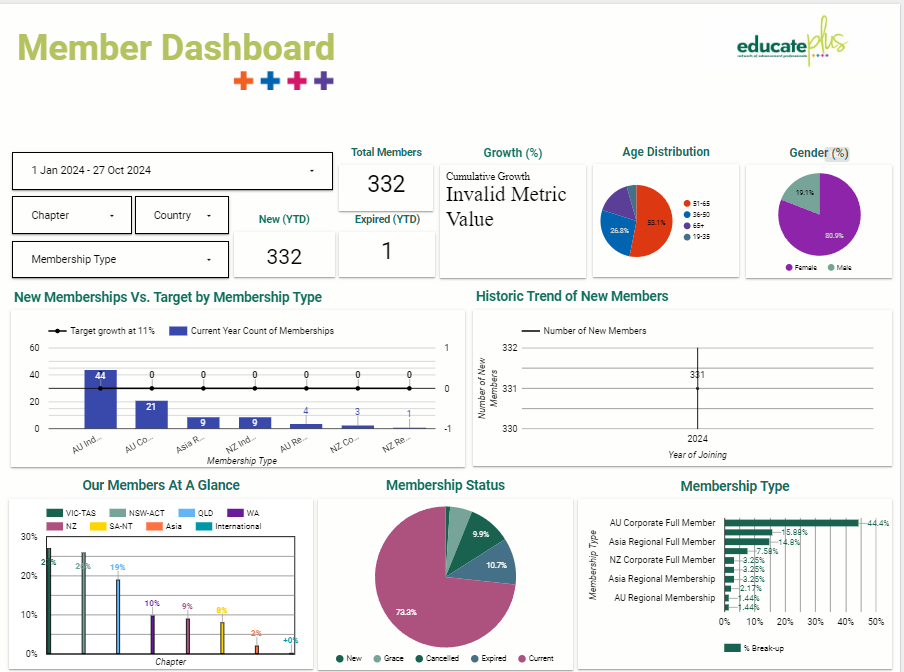
```

The dashboard shown in image \@ref(fig:insight-4) includes drill-down functionality, allowing stakeholders to click on specific segments within charts to access detailed data points for each selected filter. 
For example, selecting a specific date range for the current year-to-date (YTD) in the main page filter will update the dashboard to display the count of new members, recent trends among members, and insights into growth and retention patterns. Additionally, filtering by gender, such as female members, enables stakeholders to analyze gender-specific trends, offering valuable insights that can inform customized engagement strategies and programs.

*Insights Gained* - The Members Dashboard has provided a comprehensive analysis of key trends, showcasing significant opportunities for growth in specific regions. Additionally, it highlights member interests that have gained notable attention, particularly in the area of admissions. The dashboard functionality allows users to filter data by various criteria, which adds a layer of detail to the analysis. This enhanced capability supports the development of data-driven decisions, enabling Educate Plus to design more targeted initiatives and refine their strategies effectively. By understanding these trends and preferences, stakeholders can optimize their approaches to better align with member needs and maximize engagement.

### Membership Dashboard 

The Membership Dashboard focuses on tracking the member retention, the growth of members across different membership types and regions. It provides the membership and finance teams with data on retention rates, new member acquisition, and membership distribution, which supports proactive engagement strategies.

The key insights of the dashboard includes:

- **Classification by Membership Type and Chapter** - With the different membership classifications as shown in image \@ref(fig:membership-1), the dashboard categorizes them by type and chapter, offering a clear view of their distribution. Stakeholders can pinpoint segments requiring more attention and develop improvement strategies, tailoring their engagement efforts accordingly.

- **Retention Rate Tracking** - The dashboard in image \@ref(fig:membership-2) shows retention percentages categorized by membership type, which allows easy identification of segments with lower retention rates. This information helps the stakeholders send targeted communications to members, improving retention. By utilizing these insights, they can allocate resources effectively to enhance retention in the areas that need it most, ultimately ensuring a stable membership base.

- **New Member Growth against Target** - The dashboard provides a comparative analysis of new member counts relative to an annual growth target of 11%, thereby showcasing a comprehensive perspective on their membership retention effectiveness. This allows them to check how their training programs with the current members are working. Using this year's performance metrics, the dashboard allows for setting and automatically adjusting target figures for the next year, thereby improving the efficiency of future planning.

- **Date Range drill-down filter** - The dashboard includes a date range control that allows stakeholders to compare new member growth over different periods, such as year-over-year or quarter-over-quarter. This helps to assess growth trends over time and identify any seasonal patterns in member acquisition.

- **Automated Reporting** - Previously, the member relations team had to manually extract their membership numbers from their reporting CRM tool, which consumed a lot of time for them. They would access the database, extract CSV files, and compile data manually to prepare reports. By automating this process in the form of membership dashboard, it eliminates this time-consuming process by allowing to download reports with a few clicks. This streamlined access to accurate, up-to-date numbers supports faster, data-driven decision-making.

*Insights gained* - The Membership Dashboard identifies areas where retention rate can be improved. For instance, the lower retention rates in certain membership types have led to specific initiatives aimed at retaining members. Additionally, monitoring the growth of new members has allowed for an evaluation of the effectiveness of the growth strategies. By concentrating on relevant membership types, the dashboard aligns with Educate Plus’s current structure, ensuring that the insights provided remain accurate and actionable.

### Events Dashboard 

The Events Dashboard offers Educate Plus valuable insights into event engagement, revenue generation, and attendee demographics. This information enables the organization to make informed decisions that improve member experiences and facilitate event planning. By analyzing trends, participation levels, and revenue across various chapters and demographic groups, the dashboard empowers stakeholders to effectively target their efforts and tackle specific engagement challenges. Below, we will interpret the outputs of the dashboard's key components and the benefits they bring to Educate Plus.

The key insights of the dashboard includes:

- **Attendance Rate**

```{r attendance, fig.cap="Events Attendance Metric",out.width="200px", fig.align="center", fig.pos="H"}
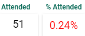
```

The attendance rate metric shown in image \@ref(fig:attendance) indicates the percentage of registrants who actually attend the events. A lower attendance rate shows that there is a bizarre mistake.  This is because the data captured did not correctly update the status of attendees to reflect their attendance. We have implemented an automation process so that when updates are made in the future, they will be reflected automatically.  
For example, if the attendance rate drops during certain months, it could prompt the marketing team to modify their communication strategies or reschedule events to better align with member availability. By tracking attendance trends, Educate Plus can refine its event timing and promotion strategies to enhance attendance rates, ultimately enabling stronger engagement.

- **Financial Performance & Revenue Tracking**  

```{r perform, fig.cap="Financial Health Tracking",out.width="200px", fig.align="center", fig.pos="H"}
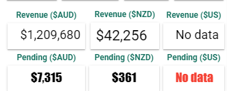
```

With insights into the revenue generated by each event as depicted in image \@ref(fig:perform) , segmented by currencies (AUD, NZD, and USD), Educate Plus can easily assess the financial impact of its events. The dashboard displays both collected and pending revenue, providing a clear view of the financial pipeline and expected future income.

- **Top Events by Revenue and Registrations**: This section in image \@ref(fig:events-2) shows highest-performing events, such as the Advancement Practitioner Training and the International Conference. This information allows stakeholders to replicate successful formats or topics. The financial success of specific events can inform future resource allocation, focusing on events that have demonstrated a strong return on investment (ROI).  
  By identifying revenue-driving events, Educate Plus can strategically plan future activities that align with popular topics or high-engagement formats, optimizing both financial outcomes and member satisfaction.


- **Seasonal and Chapter Based Trends** 

```{r season-trend, fig.cap="Seasonal Trends",out.width="80%", fig.align="center", fig.pos="H"}
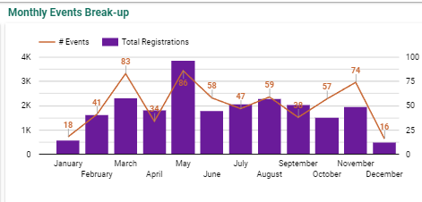
```

A spike in registrations as shown in image \@ref(fig:season-trend) in May indicates that this month is ideal for hosting major events. Likewise, chapters such as NSW-ACT show high attendance, which could justify increased investment in events specifically aimed at this region. These insights enable Educate Plus to refine its scheduling and regional engagement strategies, aligning event planning and interests for maximum impact.

- **Personalized Communication through Registration & Payment Status**

```{r personalized, fig.cap="Personalized communication through filters",out.width="80%", fig.align="center", fig.pos="H"}
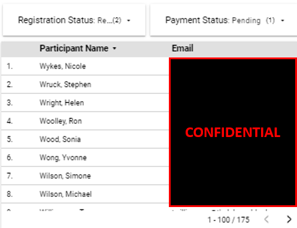
```

One of the dashboard's most valuable interactive features is the ability to filter by registration and payment status as shown here \@ref(fig:personalized). Reminders can be sent to the people who haven’t completed their payment, while follow-up communications can be tailored for attendees based on their attendance history.

  By customizing communications according to registration and payment status, Educate Plus can offer a more personalized experience, which increases engagement with each participant. This targeted approach addresses a previous challenge by automating segmented communication, reducing manual effort, and boosting response rates. With these personalized follow-ups, Educate Plus can enhance participant engagement, minimize payment delays, and build stronger relationships with attendees.

- **Engagement Classification for Further Analysis** - On the Member Engagement Page \@ref(fig:events-3), the dashboard enables the export of data pertaining to participant registrations and chapter-specific event into Excel. Upon applying relevant filters, such as date range and chapter, the team can categorize participants according to their engagement levels: Low, Moderate, or High. This classification serves to assist the organization in identifying members who are highly engaged as well as those who may require further outreach.

Following the exportation of the data, it is utilized to compute each participant's engagement level based on the ratio of attended events to the total number of available events. By establishing specific thresholds (for instance, categorizing attendance below 20% as Low Engagement), the team can effectively segment their outreach strategies. This identification of engagement levels enables Educate Plus to prioritize communication with members demonstrating low engagement, thereby facilitating re-engagement efforts and enhancing member retention.

# Discussion 

## Project Success

The dashboards developed for Educate Plus successfully addressed the key goals and objectives outlined at the start of the project. The primary aim was to create a tool that could provide the organization with actionable insights into member engagement, event participation, and overall membership trends. These dashboards now enable the team to monitor key performance indicators (KPIs) such as membership growth, event attendance, and engagement levels, ensuring data-driven decision-making.

The Member Dashboard highlights critical metrics like total members, new memberships, and engagement trends, enabling the team to track growth and retention efforts in real time. The inclusion of member demographics (such as gender, age distribution, and institution type) allows for more targeted outreach and resource allocation, helping the organization tailor its services to meet the needs of various member segments.

Similarly, the Event Dashboard provides valuable insights into event performance, including attendance rates and chapter-wide event revenue. By segmenting data by chapter, the dashboard empowers the team to evaluate regional engagement and plan future events strategically. Moreover, the integration of year-over-year event trends and monthly breakdowns offers a clear picture of event participation over time, allowing for better forecasting and planning.

Overall, the dashboards have not only met the project objectives but have also improved operational efficiency by consolidating data into easy-to-use, real-time visuals.

## Impact on Educate Plus Operations

The development of the Members, Membership, and Events Dashboards has significantly impacted Educate Plus (EP) operations by enhancing data accessibility, improving decision-making, and making the organization to engage with members more effectively. These dashboards have transformed complex data into actionable insights, enabling stakeholders across departments to make data-driven decisions, tailor engagement strategies, and optimize resource allocation. The following outlines several ways how these dashboards have improved operational efficiency and effectiveness within Educate Plus.

- **Enhanced Decision-Making with Real-Time Insights** - Before implementing the dashboards, Educate Plus relied on manual processes to collect, organize, and interpret data from multiple sources. This time-intensive approach limited the ability to make quick, informed decisions. With real-time access to membership, events, and engagement metrics, stakeholders can now monitor performance against key indicators, set targets, and respond proactively to emerging trends.

  The dashboards provide a centralized, user-friendly interface for viewing membership growth, event attendance, and revenue generation. This consolidated access allows the marketing, membership, and finance teams to continuously assess their progress and make timely adjustments to their strategies. 

  The ability to view trends over specific periods (e.g., monthly, quarterly, annually) enables Educate Plus to identify peak engagement periods and optimize event scheduling and membership campaigns accordingly. This strategic insight supports more effective planning and alignment with organizational goals.

- **Increased Engagement through Personalization** - One of the key advantages of the dashboards is the ability to look into specific metrics—such as member interests, event registration status, and payment completion—enabling personalized communications. This feature enhances Educate Plus's ability to engage members by tailoring interactions based on each individual's profile and activity level.

  By filtering data based on registration and payment status, the team can send personalized reminders and follow-ups, resulting in higher engagement rates. This targeted approach fosters a customized communication strategy that boosts member satisfaction and loyalty.
  
  Insights from the Events Dashboard allow Educate Plus to identify high-engagement events and demographics. This enables the events team to replicate successful formats and topics. Additionally, chapter-level participation data supports the development of region-specific programming tailored to members' unique interests and needs.

- **Improved Resource Allocation & Financial Tracking** - The financial data available through the dashboards—especially revenue tracking by currency and chapter—has allowed to optimize resource allocation across its regional chapters and event programs. By identifying revenue-generating activities and regions with high engagement, the finance and events teams can prioritize efforts and funding where they will be most effective.

- **Process Efficiency for Time Saving** - The ability to export data directly from the dashboards into Excel for further analysis, such as to calculate engagement levels has streamlined the reporting process. This functionality allows team members to quickly produce customized reports to support decision-making without extensive data processing.

  Along-with this, automating data visualization and updating key metrics in real-time has helped the Educate Plus stakeholders save up significant time, allowing them to concentrate on strategic planning, member engagement, and program development rather than administrative tasks.


The integration of the **Members**, **Membership**, and **Events Dashboards** has not only enhanced operational efficiency but also significantly improved *Educate Plus*'s capacity to serve its members. This improvement is achieved through targeted engagement, optimized resource allocation, and proactive decision-making. By facilitating easy access to critical metrics, promoting personalized communication, and streamlining the reporting process, these dashboards have become vital tools for aligning *Educate Plus*'s operations with its strategic objectives.

## Limitations

Throughout the development of this project, several limitations were identified that need to be addressed to enhance the functionality and analytical power of the dashboard system. While the current dashboards offer substantial insights into member activity, engagement, and event attendance, there are areas where more advanced tools and methodologies could significantly improve both the scope and depth of analysis.

1. **Need for More Powerful Dashboard Tools**: While Looker Studio has served as a valuable platform for the creation of dashboards, it has limitations when it comes to handling complex metrics and conducting predictive analytics. This is primarily due to Looker Studio’s lack of advanced computational capabilities, such as the re-aggregation of metrics or integration with more sophisticated data processing tools like Python or R.

-   **Advanced Metric Calculations**: In Looker Studio, complex re-aggregations or layered metrics are difficult to calculate. However, Power BI or Tableau, when connected with Python or R, can handle much more complex calculations. For example, integrating with Python would allow for real-time metric recalculations based on user-defined parameters, something Looker Studio lacks.

-   **Predictive Analytics**: In addition to handling more advanced metrics, tools like Python and R would allow us to integrate predictive analytics into the dashboards. With Python, we could develop models that predict membership renewal rates, identify members at risk of cancellation, or even forecast event attendance based on historical trends. Examples of predictions include:

    -   **Predicting Membership Churn**: By analyzing past member behavior and engagement, we could predict which members are at risk of not renewing their membership.

    -   **Attendance Forecasting**: Based on historical attendance data, we could forecast the expected number of attendees for upcoming events, allowing for more efficient resource allocation.

    -   **Engagement Scoring**: With machine learning algorithms in R, we could predict which members are likely to become highly engaged based on their past interaction patterns and member attributes.

Without more powerful tools, these advanced analyses remain out of reach in Looker Studio, limiting the depth of insights that can be derived from the data.

2. **Data Blending Constraints**:Another limitation in Looker Studio is the way it handles data blending. While the platform does allow for blending between datasets, the functionality is somewhat limited compared to more robust systems. LookerStudio’s blending is similar to using pivot tables in Excel, and while it can combine data from multiple sources, it cannot perform more advanced data lookups or reference external datasets in a meaningful way.

  For instance, when blending members' data and event attendance data, LookerStudio matches rows based on common identifiers (e.g., John Doe’s contact ID). While it can show John Doe's event attendance, it cannot reference an external dataset to show the number of available events John Doe could have attended. This prevents a more comprehensive understanding of member engagement, as we can only see what members have attended, not what opportunities they may have missed. In a more sophisticated tool, a lookup function could allow us to reference event availability data and provide a clearer picture of the extent to which each member is engaging with available resources.

3. **Partial Picture of Engagement Levels**: The engagement metric as it stands is limited to evaluating event attendance, which only tells part of the story. While it is useful for understanding how members are engaging with organizational events, there is still much to be done in terms of measuring overall engagement, which includes other interactions with the organization, such as communication, content consumption, participation in webinars, and more.

-   **Industry Standard Comparisons**: In its current form, the dashboard does not benchmark member engagement against industry standards. Adding such comparisons would allow Educate Plus to see how their engagement metrics stack up against other organizations in the field, providing a relative measure of success.

-   **Comprehensive Member Data**: Engagement should ideally be measured not just by event attendance but also by members' interactions with newsletters, their participation in forums, responses to surveys, etc. These factors, combined with attendance data, would provide a more complete view of member engagement. LookerStudio does not allow for the integration of these various data points as effectively as more advanced tools would.

In conclusion, while the current dashboard provides valuable insights into membership trends and event engagement, the limitations in terms of data blending, advanced metric calculations, and engagement measurement prevent it from being a fully comprehensive tool. By incorporating more advanced platforms such as Power BI or Tableau with integrations into Python or R, we could overcome these limitations and build a more dynamic, insightful system that leverages the full scope of data available. This would allow Educate Plus to not only track current trends but also predict future ones, enhancing decision-making and resource allocation significantly.

# Future Work

While the current dashboards provide valuable insights into member engagement and event participation, they offer only a partial picture of overall member engagement. There is significant opportunity to enhance the system by incorporating additional metrics and data sources to gain a more comprehensive understanding of member behavior. In particular, several key engagement and marketing metrics can be included to further refine how member engagement is measured and acted upon.

**Click-Through Rates (CTR) on Communications**: Tracking how often members interact with email newsletters or announcements by measuring CTR would help gauge their interest in content beyond event attendance.

**Member Lifetime Value (MLV)**: Estimating the revenue generated by a member over the entire span of their membership could inform the organization about the most valuable segments for retention efforts.

### How to Achieve These Metrics:

-   Tracking the Customer Journey: Mapping the member journey from initial contact through on boarding and continuous engagement would offer valuable insights into the points where members are most likely to disengage. This journey can be tracked by combining CiviCRM data, event attendance, email interactions, and website activity to identify critical touch points.

-   Advanced Segmentation: By blending the data from different sources and mapping the member journey, Educate Plus can build more accurate and dynamic segmentation models. For example, members could be segmented not just by event participation but by their entire engagement history (e.g., events attended, emails opened, social media activity). This would help design tailored marketing campaigns aimed at improving retention and re-engaging inactive members.

# Conclusion 

The development of the Members, Membership, and Events Dashboards has significantly enhanced the capability of Educate Plus to leverage real-time data for strategic decision-making, personalized engagement, and efficient operating management. By consolidating essential metrics into interactive and user-friendly dashboards, this initiative has empowered Educate Plus to effectively monitor key performance indicators, assess member engagement, and optimize resource allocation across various departments.

Each dashboard serves a distinguishable function that aligns with the strategic objectives of Educate Plus. The Members Dashboard provides insights into membership demographics and growth trends, while the Membership Dashboard enables stakeholders to track retention and acquisition metrics. The Events Dashboard presents a comprehensive overview of event performance and financial health. Collectively, these tools have streamlined data access, reduced the dependence on manual reporting, and encouraged improved communication and outreach with members.

Although there are some limitations, such as challenges with data consistency and constraints on features within Looker Studio, these dashboards provide a strong foundation for ongoing improvements. Future enhancements, including predictive analytics and advanced segmentation, can further expand the dashboards’ capabilities. This will enable Educate Plus to continuously adapt to the evolving needs of its members and the educational community. Overall, this project has positioned Educate Plus to make proactive, data-driven decisions that align with its mission of fostering educational advancement and community engagement.


